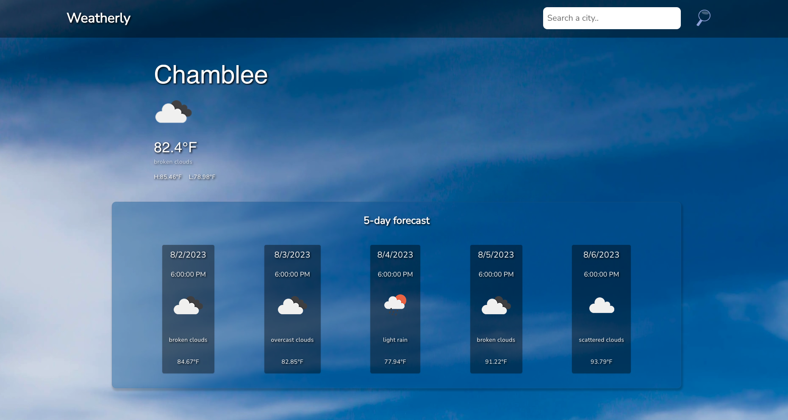

# **Weatherly**
## **Date**: 08/02/2023
### **By**: Anatoliy Agadzhanov
#### [GitHub](https://github.com/yesanatoliy) | [LinkedIn](https://www.linkedin.com/in/anatoliy-agadzhanov-5a2a54173/) 
***
### ***Description***
Weatherly is a weather app in which users can see the current weather and a 5 day weather forecast for their location. Users can also search by city to find out the current weather and forecast for any other city in the globe.
***
### ***Getting Started***
You can navigate to the website [here!](https://a-weatherly-app.netlify.app/) Or, you can clone the code, cd into the weatherly-app directory and run npm i and npm run serve to host it on your local machine. Make sure you have a local env variable with your API key for OpenWeather in it.

***
### ***Technologies Used***
* Vue3 composition API
* TypeScript
* OpenWeather API
* Pinia
* Node.js
* CSS
    * Vuetify
* Geolocation API

***
### ***Screenshots***
#### **Home Page**

***
### ***Future Updates***
- [ ] Add vuetify icons
- [ ] Clean up transitions
- [ ] Clean up header
- [ ] Deploy

***

### ***Credits***

Styling library: [Vuetify](https://vuetifyjs.com/en/)

Images: [unsplash.com searches](https://unsplash.com)

Favicon generator: [favicon.io](https://favicon.io/)